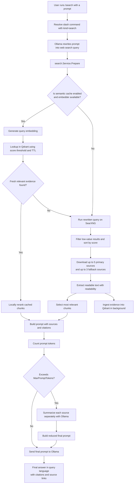

# Detailed /search workflow

[Back to docs index](README.md) | [Previous: Language and localization](09-language-and-localization.md)

This document describes the internal `/search` execution flow in detail.

## Pipeline summary

1. The user runs `/search` with a natural-language prompt.
2. The query rewriting model (`search_query_model`) generates a web-search-oriented query.
3. The search service prepares context and optionally checks semantic cache in Qdrant.
4. On fresh high-score cache hit, cached evidence is reranked and reused.
5. On cache miss, SearXNG is queried and top sources are downloaded.
6. Readable content is extracted and reduced into relevant chunks.
7. A final grounded prompt is built and sent to the main model.
8. If token budget is exceeded, sources are first summarized, then merged.
9. Final answer is returned in the prompt language, with citations and sources.

## Flow diagram

## Notes

- `search_timeout` controls the web phase timeout.
- `llm_resolve_timeout` controls the query resolution phase timeout.
- `llm_timeout` controls the final model response timeout.
- `timeout` is kept as a backward-compatible fallback for both phases.
