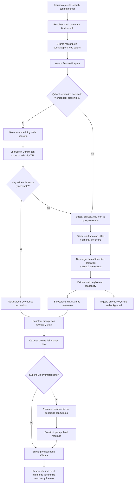

# sparkle-cli

sparkle-cli is a Bubble Tea terminal assistant for shell work. It talks to Ollama over native HTTP, keeps a session in memory, supports slash commands, and can hand a generated command back to Zsh.

## Requirements

- Go 1.22+
- Ollama running locally or reachable through `ollama_url`
- Zsh with ZLE enabled

## Configuration

The config path follows XDG and defaults to `~/.config/sparkle-cli/config.yaml`.

```yaml
ollama_url: http://localhost:11434
search_url: https://search.nest.com.ar/search
search_embedding_model: nomic-embed-text
model: gemma4
system_prompt: |
  You are a terminal expert. Produce concise, correct shell guidance and prefer returning a single command when the user is asking for one.
timeout: 30
search_timeout: 60
llm_resolve_timeout: 90
llm_timeout: 240
qdrant_enabled: false
qdrant_host: qdrant.nest.com.ar
qdrant_port: 6334
qdrant_api_key: ""
qdrant_use_tls: true
qdrant_collection: semantic_cache
qdrant_score_threshold: 0.90
qdrant_ttl_hours: 48
qdrant_pool_size: 3
editor: neovim
commands:
  explain:
    template: "Explain this command concisely: {{.Input}}"
  fix:
    template: "Fix the errors in this command: {{.Input}}"
  cheat:
    template: "Show usage examples for: {{.Input}}"
  generate-code:
    template: "Generate the shell command that matches this description. Return only the command, with no explanation or markdown: {{.Input}}"
  search:
    kind: search
  translate:
    model: translategemma
    template: "Translate the following text into {{.Language}}. Return only the translation, with no extra explanation or markdown: {{.Text}}"
```

Qdrant cache-first example:

```yaml
search_url: https://search.nest.com.ar/search
search_embedding_model: nomic-embed-text
qdrant_enabled: true
qdrant_host: qdrant.nest.com.ar
qdrant_port: 6334
qdrant_api_key: ${QDRANT_API_KEY}
qdrant_use_tls: true
qdrant_collection: semantic_cache
qdrant_score_threshold: 0.90
qdrant_ttl_hours: 48
qdrant_pool_size: 3
```

With `qdrant_enabled: true`, `/search` tries semantic cache first over Qdrant gRPC and only falls back to SearXNG when there is no fresh high-score match. Cached web evidence is chunked, deduplicated by SHA-256, and ingested in the background after a successful web fetch.

## Run

```bash
go run ./cmd/sparkle-cli --context "git log --oneline"
```

Key bindings inside the TUI:

- `Enter`: send the current prompt to Ollama
- `Tab`: autocomplete the active slash command or suggestion
- `Ctrl+T`: cycle between `Normal`, `Reasoning`, and `Chat` mode
- `Ctrl+E`: open the current input in your configured editor
- `Ctrl+L`: clear the current conversation
- `Ctrl+O`: accept the latest assistant response and print it to stdout
- `Ctrl+Y`: copy the latest assistant response to the clipboard
- `Ctrl+C`: cancel an in-flight request, or exit if idle
- `Esc`: exit without emitting a command

`Chat` mode sends the previous user and assistant messages as conversation context on each request. `Reasoning` mode keeps the existing thinking prompt behavior without adding prior turns.

Supported editors for `editor` are `neovim` (default), `vim`, `vscode`/`visual studio code`, and `emacs`.

## Zsh Bridge

Source `scripts/init.zsh` from your `.zshrc` after the binary is on `PATH`.

```zsh
source /path/to/sparkle-cli/scripts/init.zsh
```

The widget binds `Ctrl+G`. It captures `$BUFFER`, opens the TUI with `--context`, and only replaces `$BUFFER` when the process exits successfully and emits a non-empty command.

## Slash commands

Slash commands are expanded before the prompt is sent to Ollama.

- `/explain ls -la`
- `/fix kubectl get pods -A --namspace kube-system`
- `/cheat find . -name '*.go'`
- `/generate-code list the processes using port 3000`
- `/search how to change the sudo prompt message`
- `/translate english This is a test`

`/search` first asks the model to rewrite the original prompt into an optimized search query. If Qdrant semantic cache is enabled, it generates an embedding for the query, checks Qdrant for fresh high-score evidence, reranks the hits locally, and answers from cache when the evidence is still valid. If there is no fresh cache hit, it runs the rewritten query against SearXNG, sorts the results by `score`, takes up to 5 sources, downloads each URL, extracts readable content, and sends that material back to the model to produce a summary with source links at the end. The original prompt remains the main context for the final answer. If the combined context is too large, the tool first summarizes each source separately and then builds a final summary.



`timeout` is kept for backward compatibility and works as a fallback for both flows. If you want to tune them separately, use `search_timeout` for the web phase, `llm_resolve_timeout` for the LLM resolution phase, and `llm_timeout` for the model response.

## Development

```bash
go test ./...
```