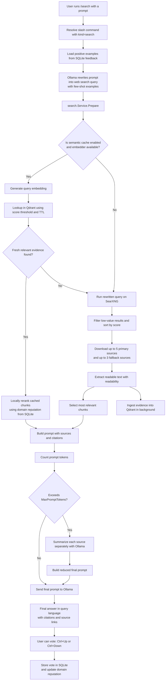

# Detailed /search workflow

[Back to docs index](README.md) | [Previous: Language and localization](09-language-and-localization.md)

This document describes the internal `/search` execution flow in detail.

## Pipeline summary

1. The user runs `/search` with a natural-language prompt.
2. The query rewriting model (`search_query_model`) generates a web-search-oriented query, enhanced with dynamic few-shot examples from positive user interactions stored in SQLite.
3. The search service prepares context and optionally checks semantic cache in Qdrant.
4. On fresh high-score cache hit, cached evidence is reranked using domain reputation scores derived from accumulated user votes, then reused.
5. On cache miss, SearXNG is queried and top sources are downloaded.
6. Readable content is extracted and reduced into relevant chunks.
7. A final grounded prompt is built and sent to the main model.
8. If token budget is exceeded, sources are first summarized, then merged.
9. Final answer is returned in the prompt language, with citations and sources.
10. User can vote on the result using **Ctrl+Up** (positive) or **Ctrl+Down** (negative), which updates the feedback database to improve future rankings.

## Flow diagram

## Feedback loop architecture

The feedback system is built on a hybrid approach:

- **SQLite database** serves as the source of truth, storing:
  - `search_interactions`: User votes (thumbs up/down) linked to Qdrant vectors
  - `search_query_traces`: The three candidate queries generated during rewriting
  - `interaction_domains`: Domain associations for each rated response
  - `feedback_weights`: Accumulated reputation scores per domain with time-based decay

- **Qdrant** provides the semantic search index and is enriched with feedback-based reranking.

- **Vote application**: Votes are applied asynchronously via `feedback.Store.ApplyVote`, updating domain reputation scores.

- **Query rewriting enhancement**: Positive examples are extracted from SQLite to provide dynamic few-shot examples during query rewriting, improving subsequent queries.

- **Reranking formula**: `S_final = S_base + beta*up - gamma*down`, where:
  - `S_base` is the original semantic similarity score
  - `up` and `down` are accumulated reputation scores per domain
  - `beta` and `gamma` are weighting coefficients
  - Scores decay over time to prioritize recent feedback

## Notes

- `search_timeout` controls the web phase timeout.
- `llm_resolve_timeout` controls the query resolution phase timeout.
- `llm_timeout` controls the final model response timeout.
- `timeout` is kept as a backward-compatible fallback for both phases.
- User votes are persisted immediately but reranking updates are applied asynchronously to avoid latency.
